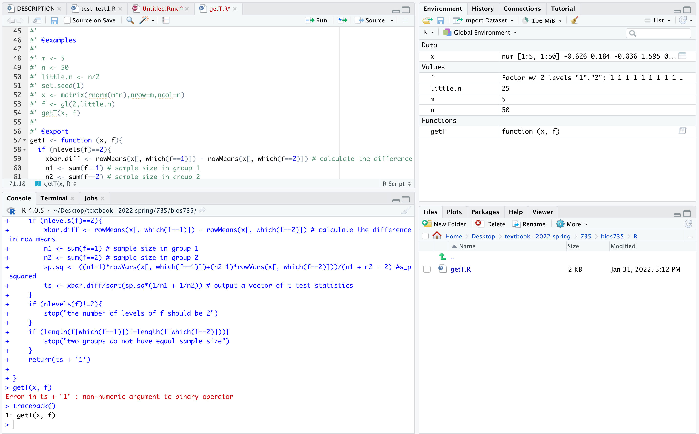

# Question 1 - build and document an R package

Take the `getT` function that you wrote for last weeks homework and
put it into a R package called `bios735`. You should add this to
your homework repository, so it looks like the directory structure
drawn below. You will re-use `bios735` across multiple homeworks.

```
statcomp-yourgithub
|-- rpkg_HW1.html
|-- rpkg_HW1.Rmd
|-- rpkg_HW2.html
|-- rpkg_HW2.Rmd
|-- bios735
    |-- DESCRIPTION
    ...
```

Add the function `getT` to `bios735` and document its two arguments
`x` and `f`, provide information about the output, add a description
and details. Export the `getT` function. So in the end, you should be
adding `.Rd` files to the `man` directory through the use of
`devtools::document`. You should also update the `DESCRIPTION` file
with your details. You can put whatever you like as the `Title` of
your package and so on. Finally, build the package. Add the `.tar.gz`
built package to your homework repository as well.


# Question 2 - add tests to your package

Use the *testthat* package to add tests to your package. The details
of the tests are up to you, but you should have both some tests of the
input to `getT`, for example, that `x` and `f` have consistent
dimension. Also, the way we wrote `getT` assumes that there is equal
sample size between the two levels of `f`: don't bother making the
function more general, but instead make sure that `f` indeed is a
factor with two levels and that both levels have `little.n` number of
samples. You should also have some tests that the function gives the
expected output on a toy dataset. You can for example, simulate a few
rows of data, and then check that `getT` gives the same answer as
`t.test` with `var.equal=TRUE`. Remember to add the tests directory to
your GitHub repository so that the graders can see it. You can try out
your tests with `test_package` or `test_file`.

Finally, run `check(manual=TRUE)` from within your package. Make sure
that it passes without error, including `checking tests ...` and put
the output below: 

```
#PUT THE OUTPUT OF CHECK HERE:
> check(manual=TRUE)
ℹ Updating bios735 documentation
ℹ Loading bios735
Warning: [/Users/karen/Desktop/textbook -2022 spring/735/bios735/R/getT.R:10] @export may only span a single line
Writing NAMESPACE
Writing NAMESPACE
── Building ───────────────────────────────────────────────────────────────────────────── bios735 ──
Setting env vars:
• CFLAGS    : -Wall -pedantic -fdiagnostics-color=always
• CXXFLAGS  : -Wall -pedantic -fdiagnostics-color=always
• CXX11FLAGS: -Wall -pedantic -fdiagnostics-color=always
• CXX14FLAGS: -Wall -pedantic -fdiagnostics-color=always
• CXX17FLAGS: -Wall -pedantic -fdiagnostics-color=always
• CXX20FLAGS: -Wall -pedantic -fdiagnostics-color=always
────────────────────────────────────────────────────────────────────────────────────────────────────
   /Library/Frameworks/R.framework/Resources/etc/Renviron: line 61: RETICULATE_PYTHON: command not found
✓  checking for file ‘/Users/karen/Desktop/textbook -2022 spring/735/bios735/DESCRIPTION’ ...
─  preparing ‘bios735’:
✓  checking DESCRIPTION meta-information ...
─  checking for LF line-endings in source and make files and shell scripts
─  checking for empty or unneeded directories
─  building ‘bios735_0.0.1.tar.gz’
   
── Checking ───────────────────────────────────────────────────────────────────────────── bios735 ──
Setting env vars:
• _R_CHECK_CRAN_INCOMING_REMOTE_: FALSE
• _R_CHECK_CRAN_INCOMING_       : FALSE
• _R_CHECK_FORCE_SUGGESTS_      : FALSE
• NOT_CRAN                      : true
── R CMD check ─────────────────────────────────────────────────────────────────────────────────────
   /Library/Frameworks/R.framework/Resources/etc/Renviron: line 61: RETICULATE_PYTHON: command not found
─  using log directory ‘/private/var/folders/lk/j5zx9dgd0q1_1cdkddh3c6z40000gn/T/RtmpW04T6e/bios735.Rcheck’
─  using R version 4.0.5 (2021-03-31)
─  using platform: x86_64-apple-darwin17.0 (64-bit)
─  using session charset: UTF-8
─  using option ‘--as-cran’
✓  checking for file ‘bios735/DESCRIPTION’
─  this is package ‘bios735’ version ‘0.0.1’
─  package encoding: UTF-8
✓  checking package namespace information
✓  checking package dependencies (1.8s)
✓  checking if this is a source package
✓  checking if there is a namespace
✓  checking for executable files ...
✓  checking for hidden files and directories
✓  checking for portable file names
✓  checking for sufficient/correct file permissions
✓  checking serialization versions
✓  checking whether package ‘bios735’ can be installed (1.3s)
✓  checking installed package size ...
✓  checking package directory ...
✓  checking for future file timestamps (798ms)
✓  checking DESCRIPTION meta-information ...
✓  checking top-level files
✓  checking for left-over files
✓  checking index information
✓  checking package subdirectories ...
✓  checking R files for non-ASCII characters ...
✓  checking R files for syntax errors ...
✓  checking whether the package can be loaded ...
✓  checking whether the package can be loaded with stated dependencies ...
✓  checking whether the package can be unloaded cleanly ...
✓  checking whether the namespace can be loaded with stated dependencies ...
✓  checking whether the namespace can be unloaded cleanly ...
✓  checking loading without being on the library search path ...
✓  checking dependencies in R code ...
✓  checking S3 generic/method consistency (528ms)
✓  checking replacement functions ...
✓  checking foreign function calls ...
✓  checking R code for possible problems (2s)
✓  checking Rd files ...
✓  checking Rd metadata ...
✓  checking Rd line widths ...
✓  checking Rd cross-references ...
✓  checking for missing documentation entries ...
✓  checking for code/documentation mismatches (376ms)
✓  checking Rd \usage sections (534ms)
✓  checking Rd contents ...
✓  checking for unstated dependencies in examples ...
✓  checking examples (547ms)
✓  checking for unstated dependencies in ‘tests’ ...
─  checking tests ...
   Running ‘testthat.R’
✓ 
✓  checking PDF version of manual (3.4s)
✓  checking for non-standard things in the check directory
✓  checking for detritus in the temp directory
   
   
── R CMD check results ────────────────────────────────────────────────────────── bios735 0.0.1 ────
Duration: 15.7s

0 errors ✓ | 0 warnings ✓ | 0 notes ✓
```

# Question 3 - short debugging example

The last question is a short one. You should (temporarily) add a bug
to `getT`, which can be a either a bug that produces an error or a
silent bug which creates some kind of erroneous output. Then use one
of the debugging methods presented in the lecture to get to this point
in the code when calling the function, and examine the variables at
that point in the code, e.g. `ls()` and using `head`. Take a
screenshot of the debugging environment and add this screenshot to
your GitHub repository.




