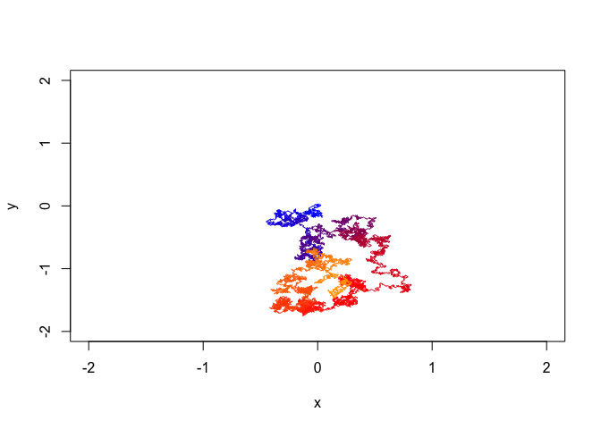
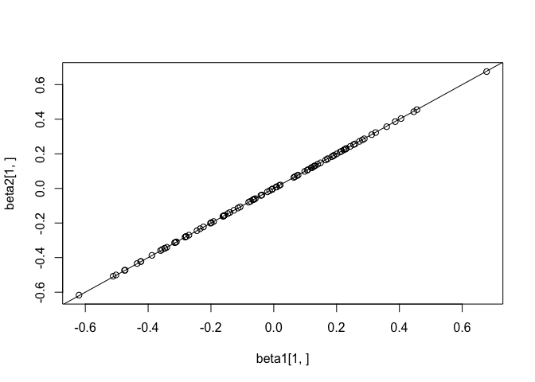
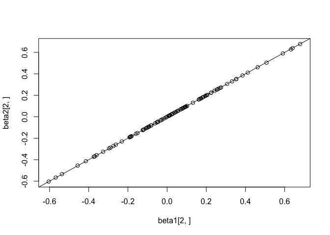

Homework 3 - C++ code from R
================
Shuang Du
02/07/2022

# Setup and hints

For all of the following functions, you should add these functions to
your R package, by adding code to the `src` directory, adding the
necessary importing and linking to lines to `DESCRIPTION`, and then
writing and exporting a wrapper R function (e.g. adding a `@export`
tag).

Remember to include the following at the top of your C++ script (you do
not include `Rcpp.h` because `RcppArmadillo.h` includes this). As the
homework uses RcppArmadillo, the following covers all questions:

    #include <RcppArmadillo.h>
    using namespace Rcpp;

Remember that Armadillo uses 0-based indexing. This is true for square
bracket indexing `z[0]` or `Z[0,0]` as well as using the row and column
getters: `z.row(0)` and `z.col(0)`.

# Question 1 - simple Rcpp function

Write a simple Rcpp function that implements the following R code:

`ifelse(x < 0.0, 1.0, exp(x))`

Compare it’s output in R. Your R wrapper function should be named
`one.or.exp()`.

``` r
library(devtools)
```

    ## Loading required package: usethis

``` r
document("bios735")
```

    ## ℹ Updating bios735 documentation

    ## ℹ Loading bios735

    ## Warning: [/Users/karen/Desktop/textbook -2022 spring/735/hw3/bios735/R/
    ## getT.R:10] @export may only span a single line

    ## Writing NAMESPACE
    ## Writing NAMESPACE

``` r
load_all("bios735")
```

    ## ℹ Loading bios735

``` r
x <- -10:10
one.or.exp(x)
```

    ##  [1]     1.000000     1.000000     1.000000     1.000000     1.000000
    ##  [6]     1.000000     1.000000     1.000000     1.000000     1.000000
    ## [11]     1.000000     2.718282     7.389056    20.085537    54.598150
    ## [16]   148.413159   403.428793  1096.633158  2980.957987  8103.083928
    ## [21] 22026.465795

``` r
all.equal(ifelse(x < 0.0,1.0,exp(x)), one.or.exp(x))
```

    ## [1] TRUE

# Question 2 - random walk in C++ and vectorized R

Write a random walk function in C++, call the wrapper function for your
C++ function, `randomWalk2`. Your C++ function should follow the same
style as the function below, by iterating over 1-niter, despite the fact
that the random walk can be vectorized in R as a cumulative sum. You
will later compare to the vectorized random walk in R.

Hint: you should use the C++ function
`Rf_rbinom(integer size, numeric probability)` function to flip the coin
in the random walk.

Compare the output of `randomWalk2` to ensure that it produces the same
output as `randomWalk1`, with the same seed set in R. How much faster is
your random walk?

``` r
niter <- 1e4
lambda <- .01
randomWalk1 <- function(niter,lambda) {
  x <- numeric(niter)
  y <- numeric(niter)
  for (i in seq_len(niter)[-1]) {
    x[i] <- x[i-1] + lambda * (2.0 * rbinom(1,1,0.5) - 1.0)
  }
  for (i in seq_len(niter)[-1]) {
    y[i] <- y[i-1] + lambda * (2.0 * rbinom(1,1,0.5) - 1.0)
  }
  list(x=x,y=y)
}
myplot <- function(dat) {
  niter <- length(dat$x)
  plot(0,type="n",xlim=c(-2,2),ylim=c(-2,2),xlab="x",ylab="y")
  cols <- colorRampPalette(c("blue","red","orange"))(100)
  with(dat, segments(x[-niter],y[-niter],x[-1],y[-1],col=rep(cols,each=niter/100)))
}
set.seed(5)
dat1 <- randomWalk1(niter,lambda)
str(dat1)
```

    ## List of 2
    ##  $ x: num [1:10000] 0 -0.01 0 0.01 0 -0.01 0 0.01 0.02 0.03 ...
    ##  $ y: num [1:10000] 0 0.01 0 0.01 0.02 0.03 0.02 0.03 0.02 0.01 ...

``` r
myplot(dat1)
```

<!-- -->

Your random walk:

``` r
document("bios735")
```

    ## ℹ Updating bios735 documentation

    ## ℹ Loading bios735

    ## Warning: [/Users/karen/Desktop/textbook -2022 spring/735/hw3/bios735/R/
    ## getT.R:10] @export may only span a single line

    ## Writing NAMESPACE
    ## Writing NAMESPACE

``` r
load_all("bios735")
```

    ## ℹ Loading bios735

``` r
set.seed(5)
dat2 <- randomWalk2(niter,lambda)
str(dat2)
```

    ## List of 2
    ##  $ x: num [1:10000] 0 -0.01 0 0.01 0 -0.01 0 0.01 0.02 0.03 ...
    ##  $ y: num [1:10000] 0 0.01 0 0.01 0.02 0.03 0.02 0.03 0.02 0.01 ...

``` r
myplot(dat2)
```

<!-- -->

``` r
all.equal(dat2$x, dat1$x)
```

    ## [1] TRUE

``` r
all.equal(dat2$y, dat1$y)
```

    ## [1] TRUE

``` r
library(microbenchmark)
microbenchmark(randomWalk1(niter,lambda),randomWalk2(niter,lambda),times=10)
```

    ## Unit: microseconds
    ##                        expr       min        lq      mean     median        uq
    ##  randomWalk1(niter, lambda) 43102.846 48512.450 67772.550 56167.8725 80526.907
    ##  randomWalk2(niter, lambda)   713.841   730.925   924.476   821.1935  1094.012
    ##         max neval
    ##  141810.965    10
    ##    1510.081    10

Now write a vectorized version of the random walk in R and call this
function `randomWalkVectorized`. Compare to ensure it gives the same
result at `randomWalk1`, and compare its speed to `randomWalk1` and to
`randomWalk2`:

``` r
randomWalkVectorized <- function(niter,lambda) {
  x <- c(0, cumsum(lambda * (2.0 * rbinom((niter-1),1,0.5) - 1.0)))
  y <- c(0, cumsum(lambda * (2.0 * rbinom((niter-1),1,0.5) - 1.0)))
  list(x=x,y=y)
}
set.seed(5)
datVec <- randomWalkVectorized(niter,lambda)
str(datVec)
```

    ## List of 2
    ##  $ x: num [1:10000] 0 -0.01 0 0.01 0 -0.01 0 0.01 0.02 0.03 ...
    ##  $ y: num [1:10000] 0 0.01 0 0.01 0.02 0.03 0.02 0.03 0.02 0.01 ...

``` r
myplot(datVec)
```

<!-- -->

``` r
all.equal(datVec$x, dat1$x)
```

    ## [1] TRUE

``` r
all.equal(datVec$y, dat1$y)
```

    ## [1] TRUE

``` r
library(microbenchmark)
microbenchmark(randomWalk1(niter,lambda),randomWalkVectorized(niter,lambda),times=10)
```

    ## Unit: milliseconds
    ##                                 expr       min        lq      mean    median
    ##           randomWalk1(niter, lambda) 35.048547 45.651961 53.411568 54.144272
    ##  randomWalkVectorized(niter, lambda)  1.004078  1.036581  2.021219  1.270367
    ##         uq       max neval
    ##  62.946711 63.752861    10
    ##   1.634309  8.720728    10

``` r
microbenchmark(randomWalk2(niter,lambda),randomWalkVectorized(niter,lambda),times=10)
```

    ## Unit: microseconds
    ##                                 expr      min       lq     mean   median
    ##           randomWalk2(niter, lambda)  866.285 1228.714 1506.932 1458.564
    ##  randomWalkVectorized(niter, lambda) 1147.403 1226.412 2363.976 1879.631
    ##        uq      max neval
    ##  1744.865 2268.076    10
    ##  2983.935 5493.816    10

# Question 3 - simple RcppArmadillo function

Write a simple RcppArmadillo function that solves for `x` in the matrix
multiplication formula *A**x* = *b*. Call your R wrapper function
`armadilloSolve`. You can skip the part about pointing to the matrix in
R with `const arma::mat& A` for this and the following homework
question. That is, the top line of your function can look like:

    arma::mat armadillo_solve(arma::mat A, arma::vec b) {

Check that your function gives the correct answer here:

``` r
document("bios735")
```

    ## ℹ Updating bios735 documentation

    ## ℹ Loading bios735

    ## Warning: [/Users/karen/Desktop/textbook -2022 spring/735/hw3/bios735/R/
    ## getT.R:10] @export may only span a single line

    ## Writing NAMESPACE
    ## Writing NAMESPACE

``` r
load_all("bios735")
```

    ## ℹ Loading bios735

``` r
A <- matrix(runif(12),ncol=3)
x <- matrix(runif(3),ncol=1)
b <- A %*% x
xx <- armadilloSolve(A,b)
all.equal(x, xx)
```

    ## [1] TRUE

# Question 4 - column-wise ridge regression

Implement a C++ function that performs ridge regression one-by-one on
columns of a matrix `Y`, using a constant design matrix `X`, and a
variable ridge parameter `lambda`. That is, use the first element of
`lambda` for the first column of `Y` and so on. Call your R wrapper
function `colRidge2`. Again, you can skip the part about pointing from
C++ to the matrix in R and just have the top of your C++ function look
like, e.g.

    arma::mat col_ridge_2(arma::mat Y, arma::mat X, arma::vec lambda) {

Compare the output of `colRidge2` to `colRidge1`. It is not expected to
be numerically identical, but it should be “close” which you can see
from the plots. How much faster is the C++ version?

Hint: for your C++ function use the simple ridge formula:

*β̂* = (*X*<sup>*t*</sup>*X* + *λ**I*)<sup> − 1</sup>*X*<sup>*t*</sup>*y*

Hint: see the `eye()` function in Armadillo to build the identity
matrix.

``` r
document("bios735")
```

    ## ℹ Updating bios735 documentation

    ## ℹ Loading bios735

    ## Warning: [/Users/karen/Desktop/textbook -2022 spring/735/hw3/bios735/R/
    ## getT.R:10] @export may only span a single line

    ## Writing NAMESPACE
    ## Writing NAMESPACE

``` r
load_all("bios735")
```

    ## ℹ Loading bios735

``` r
set.seed(1)
n <- 100
Y <- matrix(rnorm(n*20),nrow=20)
X <- scale(matrix(rnorm(20*2),ncol=2))
lambda <- runif(n,.1,2)
library(MASS)
colRidge1 <- function(Y, X, lambda) {
  df <- as.data.frame(X)
  n <- ncol(Y)
  beta <- matrix(nrow=2,ncol=n)
  stopifnot(length(lambda) == n)
  for (j in seq_len(n)) {
    beta[,j] <- coef(lm.ridge(Y[,j] ~ 0 + V1 + V2, data=df, lambda=lambda[j]))
  }
  beta
}
beta1 <- colRidge1(Y, X, lambda)
beta1[,1:5]
```

    ##             [,1]         [,2]       [,3]       [,4]       [,5]
    ## [1,] -0.12682942  0.008888149 0.31188903  0.0205888 0.17143261
    ## [2,]  0.07738113 -0.102197878 0.02560331 -0.4147540 0.01577768

``` r
beta2 <- colRidge2(Y, X, lambda)
beta2[,1:5]
```

    ##            [,1]         [,2]       [,3]        [,4]      [,5]
    ## [1,] -0.1264175  0.008740393 0.31072209  0.02002521 0.1711246
    ## [2,]  0.0770407 -0.101904019 0.02601971 -0.41356503 0.0158899

``` r
plot(beta1[1,], beta2[1,])
abline(0,1)
```

<!-- -->

``` r
plot(beta1[2,], beta2[2,])
abline(0,1)
```

<!-- -->

``` r
all.equal(beta1[1,], beta2[1,])
```

    ## [1] "Mean relative difference: 0.003848973"

``` r
all.equal(beta1[2,], beta2[2,])
```

    ## [1] "Mean relative difference: 0.003778665"

``` r
microbenchmark(colRidge1(Y, X, lambda), colRidge2(Y, X, lambda), times=10)
```

    ## Unit: microseconds
    ##                     expr      min        lq       mean     median        uq
    ##  colRidge1(Y, X, lambda) 70739.59 73156.398 77234.2915 78164.3435 81287.711
    ##  colRidge2(Y, X, lambda)   102.23   104.671   121.1629   124.0315   131.154
    ##       max neval
    ##  81577.63    10
    ##    155.58    10
